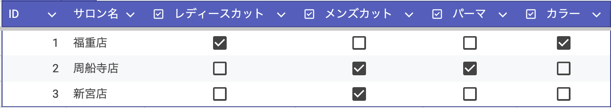
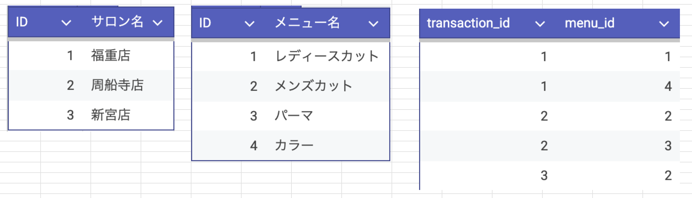

<!-- _class: title -->

# 綺麗なコードの書き方

<!-- ## - サブタイトル -->

<p class="author">武石 航汰</p>
<p class="date">2025年12月06日 (土) MIR-AIラボ</p>

---

<!-- _class: subsection -->

# コードの綺麗さ = 仕様の綺麗さ

(だと思っています．)

---

# コードの綺麗さ = 仕様の綺麗さ

- 仕様とは，コードを書く前に（手を動かす前に）考えるべきこと

<br />

- なぜコードを綺麗に書くのか
  - 効率化・保守性の向上・バグの削減
  - ↑ コード上（表面上）では制御できない部分が大きいのでは？

<br />

- 受付システムで汚い仕様のせいで，効率や保守性が悪くなった経験
  => **受付システムの"仕様"と"コード"を見てみる**

---

# 昔の受付システムの"仕様"と"コード"

仕様: 受付を`transaction`でDB化



コード: 受付されたメニュー名を表示する

```python
if transaction["レディースカット"] == 1:
    display("レディースカット")
if transaction["メンズカット"] == 1:
    display("メンズカット")
if transaction["パーマ"] == 1:
    display("パーマ")
if transaction["カラー"] == 1:
    display("カラー")
```

<!-- まあ，綺麗なコードだと思います．見やすいし，わかりやすい -->

---

# 今の受付システムの"仕様"と"コード"

仕様: 受付を`transaction`と`menu`と`transaction_menu`でDB化



コード: 受付されたメニュー名を表示する

```python
transaction = transaction.get(transaction_id)
menu_names = transaction_menu.where(transaction).join(menu).select(menu.name)
display(menu_names)
```

<!-- 一見わかりにくい？ -->

---

# メニューが変更された時のコードの違い

[昔の受付システム] メニューが変わるたびにコードが変更 => 汚くなる

```python
if transaction["レディースカット"] == 1:
    display("レディースカット")
...
if transaction["トリートメント"] == 1: # 追加
    display("トリートメント")
if transaction["シャンプー"] == 1: # 追加
    display("シャンプー")
```

[今の受付システム] メニューが変わってもコードは変更されない => 綺麗なまま

```python
transaction = transaction.get(transaction_id)
menu_names = transaction_menu.where(transaction).join(menu).select(menu.name)
display(menu_names)
```

---

# なぜコードが汚くなるのか？

コードを書く前の仕様が適切でなかったから

- メニューが変わる可能性を考慮していなかった
  - メニューが不変という前提ならば，昔の仕様でも問題ない
（むしろ適しているのかも）

- 正規化というデータベースの基礎知識を理解していなかった

---

# 綺麗なコードを書くには

- 綺麗なコードを書くには，綺麗な仕様が必要

<br />
  
- 綺麗な仕様を作るためには，一回立ち止まって何が最適なのかを考える
  - ユーザー・現場の理解
  - 基礎的な（枯れた）技術の理解

<br />

- AIによって0 ⇒ 1が圧倒的に加速
  - AIが書いたコードは綺麗なのか？
  - AIを仕様で制御する
